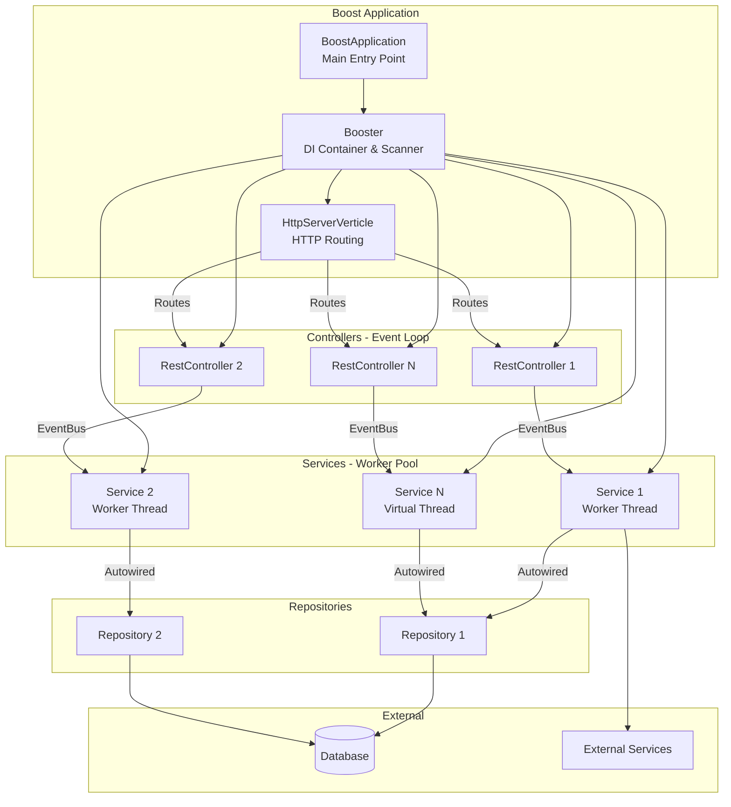
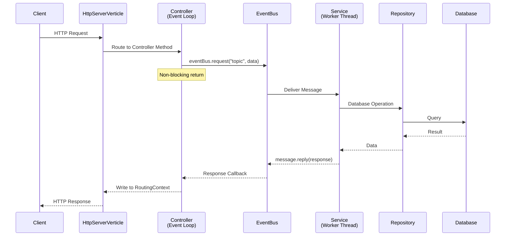
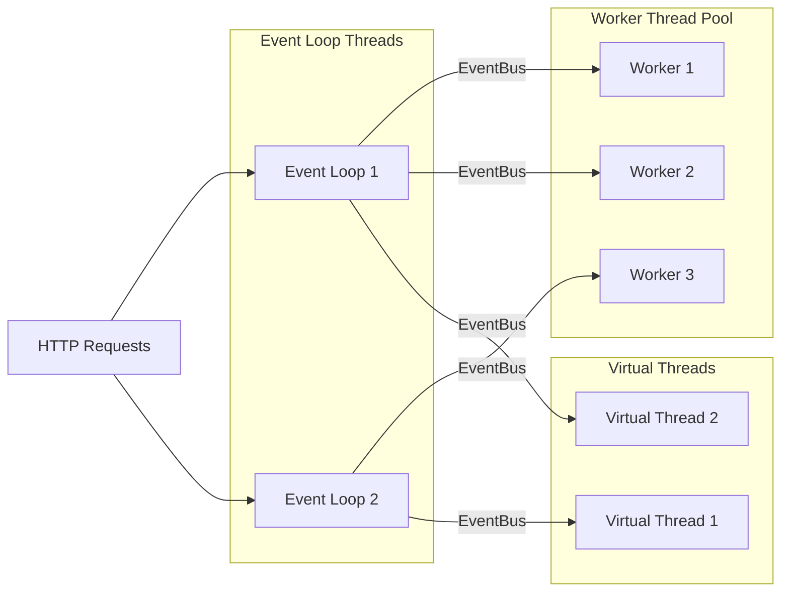

[](https://jitpack.io/#Areeb-Gillani/vertx-boost)
# vertx-boost
This project adds the flavor of SpringBoot's style annotations in vertx to reduce the learning curve. It follows the same annotation style as @RestController, @Service, @Repository, @Autowired, @RequestParam, @RequestBody, @PostMapping and @GetMapping, whereas controller and service classes should extend AbstractVerticle as per the implementation of Vertx.
 

# Architecture Overview

### High-Level Design



### Request Flow



### Component Responsibilities

| Component | Role | Threading Model |
|-----------|------|-----------------|
| `BoostApplication` | Bootstrap & lifecycle management | Main Thread |
| `Booster` | Classpath scanning, DI, endpoint registration | Startup Only |
| `HttpServerVerticle` | HTTP routing & request handling | Event Loop |
| `AbstractController` | Base controller with EventBus access | Event Loop |
| `AbstractService` | Business logic with topic binding | Worker/Virtual Thread |
| `CrudRepository` | Database operations | Connection Pool |

### Threading Model



# Design Philosophy

### Unopinionated Framework
Vertx-Boost is intentionally **unopinionated**. It provides the scaffolding to make Vert.x development easier with familiar Spring-like annotations, but deliberately does not impose:

- **Security** - Authentication, authorization, and input validation are your responsibility
- **Error Handling** - Implement your own exception handling strategy
- **Logging Standards** - Use your preferred logging framework and patterns
- **Database Transactions** - Manage transactions as per your application needs
- **Caching Strategy** - Implement caching layers as you see fit

This gives you complete freedom to architect your application according to your specific requirements without fighting against framework conventions.

### Performance vs Flexibility Trade-off

Vertx-Boost uses **runtime reflection** for routing and dependency injection. This is a conscious design decision:

| Aspect | Raw Vert.x | Vertx-Boost | Trade-off |
|--------|-----------|-------------|-----------|
| Routing | Direct method calls | Reflection-based | ~10-20% overhead |
| Startup | Faster | Classpath scanning | +1-3 seconds |
| Dynamic Loading | Manual implementation | Built-in support | Enabled |
| Learning Curve | Steep | Gentle (Spring-like) | Easier |

**Why accept this overhead?**

The reflection-based architecture enables **dynamic/hot code loading** at runtime - a powerful capability for:

- **Plugin Systems** - Load new controllers without restarting
- **Hot Deployment** - Deploy new endpoints to a running instance
- **Dynamic APIs** - Generate endpoints from configuration or database
- **A/B Testing** - Deploy experimental code to specific routes
- **Multi-tenant Customization** - Load tenant-specific logic dynamically

```java
// Dynamic controller registration at runtime
Class<?> dynamicController = myClassLoader.loadClass("com.example.DynamicController");
booster.registerDynamicController(dynamicController);

// Later, remove it without restart
booster.unregisterController("com.example.DynamicController");
```

For most I/O-bound applications (database queries, external API calls), the reflection overhead is negligible compared to network latency. The flexibility gained often outweighs the minor performance cost.
# Background and Basics
### Vertx vs Spring
Vertx is an event-driven toolkit backed by the Eclipse Foundation. It's a polyglot and is used for highly concurrent code writing. When compared to Spring (Webflux or Boot), Vertx is exceptionally fast. In my performance testing, I found Vertx to be 75% faster than Spring. Techempower has also shared very similar results on their site: https://www.techempower.com/benchmarks/#section=data-r22. Now considering this, if you want to develop a state-of-the-art application with high throughput, one should go for vertx, as it is Java's fastest unopinionated framework available today (Techempower's results also back this statement).
 
### Basics of Vertx
In Vertx, a router needs to be declared in order to register API endpoints in the application. Each route has its own handler, which entertains the logic once the API endpoint is called. It becomes very hard to maintain so many route handlers, and since most people tend to declare all the routes in the same class, it's a very hard class to maintain.
 
# Dependency
### Repository
#### build.gradle
```kotlin
allprojects {
        repositories {
            maven ("https://jitpack.io")
        }
    }
```
#### pom.xml
```xml
<repositories>
  ...
  <repository>
      <id>jitpack.io</id>
      <url>https://jitpack.io</url>
  </repository>
</repositories>
```
### Dependency
#### build.gradle
```kotlin
dependencies {
  implementation ("com.github.Areeb-Gillani:vertx-boost:1.0.2")
}
```
#### pom.xml
```xml
<dependencies>
  ...
	<dependency>
	    <groupId>com.github.Areeb-Gillani</groupId>
	    <artifactId>vertx-boost</artifactId>
	    <version>1.0.2</version>
	</dependency>
</dependencies>
```
# Configuration
Vertx says that every class that extends AbstractVerticle will be handled by its own dedicated threads and thread pools and will have its own life cycle. I am assuming that you have the basic idea of MainVerticle and WorkerVerticle. If you don't have the idea, then please read [Verticle Types](https://vertx.io/docs/vertx-core/java/#_verticle_types) first. A service is basically a runnable unit (or a verticle in terms of vertx) which run on its own thread pool. The instance field represents the number of instances this unit will have on the start up whereas the poolSize is the maximum number of instance it can create under load. Whereas, there are three types of thread pools available in the scope of vertx i.e.
1. Eventloop Thread
2. Worker Thread
3. Virtual Thread

Please use the above link in case you want to attain more knowledge about their difference. As a rule of thumb if your function is going to take more than 100ms in execution,then use of EventLoop thread is strictly prohibited as it will choke the application under load. The default threading type is "worker" and it will worker even if you don't have the "type" attribute configured.
Here is the sample JSON:
### Config.json
```json
{
   {...},
   "ServiceUnits":{
      "ExampleWorker":{
         "instance":5,
         "poolSize":6,
	 "type": "W"
      }
   },
   {...}
}
```
# Monitoring
 Add these lines for performance monitoring metrics enablement via Prometheus.
### Config.json
```json
{
   {...},
   "metrics": {
    "enabled": true,
    "tool": "prometheus"
  },
  {...}
}
```
 
# Usage
Booster, which is the initializing class of this utility, requires this JsonObject in the constructor in order to initialize.
### Initializer
Please initialize it in your main application class to run everything on startup.
```java
public class Main extends BoostApplication {
    public static void main(String[] args) {
        run(Application.class, args);
    }
}
```
### Controller
```java
@RestController
public class ExampleController extends AbstractController{
    @GetMapping("/sayHi")
    public String sayHi(){
        return "hi";
    }
    @GetMapping("/sayHello")
    public String sayHello(@RequestParam("username") String user){
        return "Hello "+user;
    }
    @PostMapping("/sayHiToUser")
    public String sayHiToUser(JsonObject body){
        return "Hi! " +body.getString("username");
    }
    @PostMapping("/replyHiToUser")
    public void replyHiToUser(JsonObject body, RoutingContext context){
         eventBus.request("MyTopic", body, reply->{
            if(reply.succeeded()){
                context.json(reply.result().body());
            }
        });
    }
    @PostMapping("/MyTopic")
    public void MyTopic(JsonObject body, HttpRequest request){
         eventBus.request("MyTopic", body, request.getResponseHandler());
    }
    @PostMapping("/MyTopicViaStr")
    public void MyTopicViaStr(String body, HttpRequest request){
         eventBus.request("MyTopicViaStr", body, request.getResponseHandler());
    }
    @PostMapping("/MyTopicViaClass")
    public void MyTopicViaClass(ClassA body, HttpRequest request){
         eventBus.request("MyTopicViaClass", body, request.getResponseHandler());
    }
}
```
#### Note
- We can't call the service function directly to keep our controller lightweight, so if you want some blocking calls, use the event bus to pass them to the worker threads.
- Return in this case will be handled by vertx, which is why the controller's return type is void. We are writing the response directly to our routing context.
- @Autowired will not work in controller classes because all the controllers run on event loops, and one can't block the event loop's thread. Vertx will throw an exception if the event loop thread is blocked that is why composition is prohibited.
 
### Service
```java
@Service("ExampleWorker") // It is the same name that is described in configuration.
public class ExampleService extends AbstractService{
    @Autowired
    DatabaseRepo myRepo;
    @Override
    public void bindTopics(){
        eventBus.consumer("MyTopic", this::replyHiToUser);
	// In case of clustered mode on, you need to use clusteredEventBus.
        // So that other microservices can discover this topic

       // clusteredEventBus.consumer("MyTopic", this::replyHiToUser);
    }
    private void replyHiToUser(Message<Object> message){
        JsonObject vertxJsonObject = (JsonObject) message; 
        message.reply("Hi "+ vertxJsonObject.getString("username"));
    }
}
```
#### Note
- Service will never return anything directly; instead, it will use the reply method to return the response.
- Bind all the methods to the topics in the start method.
 
### Repository
```java
public class DatabaseRepo {
    //Write your db operations here 
}
```
# vertx-boost-db  [](https://jitpack.io/#Areeb-Gillani/vertx-boost-db)
If you want to use a dynamic, easy-to-use database library, then please check out vertx-boost-db. It will give you all the tools you need for databases, including CrudRepository, just like Spring.
### CrudRepository
```java
@Repository("MyDbConfig")
public class DatabaseRepo extends CrudRepository<ExampleModel>{
   public DatabaseRepo (String connectionName, JsonObject config){
      super(connectionName, config);
   }
    //Write other db operations here your CRUD operations are already covered above 
}
```
"MyDbConfig" will help you manage multi-tenancy at the database level. Read more on (https://github.com/Areeb-Gillani/vertx-boost-db/blob/main/README.md)
 
